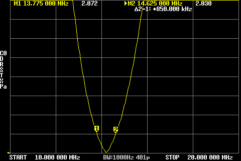
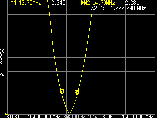
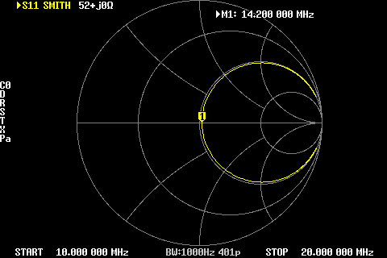
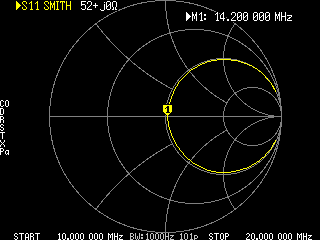

# Markers

A marker sits on one sweep point and shows the traces' values there. There are eight
(`MARKERS_MAX`); the original guide's "up to 4" is out of date.[^guide] One of them is the
**active marker** — the one the wheel moves, the one searches move, and the one the
MARKER → OPERATIONS commands use. The marker readout at the top of the screen is described in
[chapter 1](01-orientation.md).

## Turning markers on and off

**MARKER → SELECT MARKER → MARKER n** toggles a marker through three states in turn: off →
on and active → (pressed again while active) off. Enabling a marker makes it the active one;
the previously active marker becomes the *previous* marker, which the delta readout and
OPERATIONS → SPAN use. **ALL OFF** clears all eight.[^sel]

The buttons show a filled check for the active marker and an outline check for other enabled
markers. Tapping a marker on the screen also makes it active (and drags it while your finger is
down); the wheel then moves it point by point.

## Delta readout

**MARKER → SELECT MARKER → DELTA** switches the marker readout to differences: every marker's
frequency and value are shown relative to the active marker. With DELTA off and two or more
markers enabled, the readout instead shows a single `Δ1-2:` line — the frequency difference
between the active marker and the previous one.[^delta]

{width=70%}

{width=47%}

## Searching

**MARKER → SEARCH** cycles the search mode — **MAXIMUM**, **MINIMUM** or **ZERO** — and
immediately moves the active marker to that feature of the **active trace** over the whole
sweep. **SEARCH ‹ LEFT** and **SEARCH › RIGHT** move it to the next such feature in that
direction:[^search]

- MAXIMUM / MINIMUM search the trace as drawn (the highest or lowest point on the screen); LEFT
  and RIGHT step to the next local peak or dip.
- ZERO finds the point whose *value* is closest to zero, whether or not the zero line is
  inside the visible scale. On a REACTANCE trace that is the resonance; LEFT/RIGHT step to the
  next sign change, putting the marker on whichever side of the crossing is nearer zero. ZERO
  is a fork addition (upstream #107) and the mode is saved with the configuration.
- Searches apply to the active trace only; on a Smith or polar trace ZERO does nothing (there
  is no single scalar to search).

**TRACKING** repeats the search after every sweep, so the marker follows a moving peak or dip
(or resonance) while you adjust the antenna. Pressing SEARCH LEFT or RIGHT switches tracking off
again, since a manual step and an automatic re-search would fight.[^track]

## Setting the sweep from markers

**MARKER → OPERATIONS**:[^ops]

| Button | Effect |
|---|---|
| › START | Start frequency = active marker's frequency |
| › STOP | Stop frequency = active marker's frequency |
| › CENTER | Centre = active marker's frequency (the span is kept) |
| › SPAN | With **two or more** markers: start and stop = the active and the previous marker (in either order). With **one** marker: the centre is kept and the span is set so the marker lands on the edge of the sweep — the guide's "nothing happens" for a single marker is no longer true. |
| › E-DELAY | Adds the group delay measured at the marker to the active trace's electrical delay, flattening the phase there. Use it on a PHASE or DELAY trace to null out a cable; repeat to refine. |

After a START/STOP/CENTER/SPAN operation the marker indices stay where they were, so the
markers will generally sit on different frequencies in the new sweep.

## Smith-chart marker readouts

When the active trace is a Smith chart, pressing **DISPLAY → FORMAT → SMITH** again opens a
menu of marker readout formats for it:[^smith]

| Readout | Shows |
|---|---|
| LIN | linear magnitude and phase of the reflection coefficient |
| LOG | magnitude in dB and phase |
| Re + Im | real and imaginary parts of Γ |
| R + jX | series impedance, ohms |
| R + L/C | series resistance and the equivalent inductance or capacitance of X at the marker frequency |
| G + jB | admittance, siemens |
| G + L/C | conductance and the equivalent inductance or capacitance of B |
| Rp + jXp | parallel-equivalent impedance |
| Rp + L/C | parallel-equivalent resistance and L or C |

{width=70%}

{width=47%}

For an S21 Smith trace the choices are LIN, LOG, Re + Im, and the shunt and series through
impedances (R+jX / R+L/C for SHUNT and for SERIES), which assume the device is connected as a
shunt across, or in series with, the through path. The L/C readouts pick inductance or
capacitance from the sign of the reactance and compute the value at the marker's frequency.

## Console

`marker` lists the enabled markers (number, point index, frequency); `marker N` shows one;
`marker N on|off`; `marker N {index}` places a marker on a sweep point. Marker positions are
also saved in the calibration slots ([chapter 3](03-calibration.md)).

---

[^guide]: The NanoVNA user guide (cho45, nanovna.com translation) describes markers 1–4 and the START/STOP/CENTER/SPAN operations; the counts and the single-marker SPAN behaviour differ in this firmware, as noted. `nanovna.h`: `MARKERS_MAX 8`.
[^sel]: `ui.c` `menu_marker_sel_acb()`, `menu_marker_disable_all_cb()`, `active_marker_check()`.
[^delta]: `ui.c` `menu_marker_delta_acb()` (`TD_MARKER_DELTA`); readout in `plot.c` `cell_draw_marker_info()`.
[^search]: `ui.c` `menu_marker_search_acb()`, `menu_marker_search_dir_cb()`; `plot.c` `marker_search()`, `marker_search_dir()`: MAX/MIN compare screen y of the trace index, ZERO compares |value| from the format's value callback; `config._marker_search_mode`.
[^track]: `plot.c` `plot_into_index()`: `if (props_mode & TD_MARKER_TRACK) marker_search();` after every sweep; `menu_marker_search_dir_cb()` clears `TD_MARKER_TRACK`.
[^ops]: `ui.c` `menu_marker_op_cb()`: `ST_SPAN` with one marker → `set_sweep_frequency(ST_SPAN, 2·|center − f|)`; with two → start/stop from the two markers; `UI_MARKER_EDELAY` adds `groupdelay_from_array()` at the marker to `_electrical_delay[ch]`.
[^smith]: `ui.c` `menu_format_acb()` (SMITH pressed while already selected → `menu_marker_s11smith` / `menu_marker_s21smith`); readouts in `plot.c` `marker_info_list[]`.
