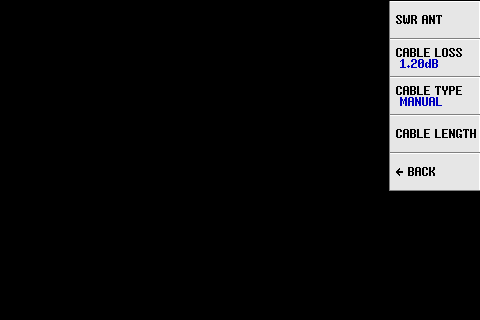
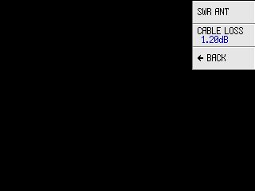
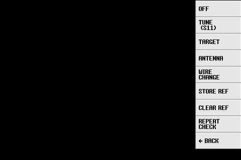

<!-- generated by tools/manual/gen_menus.py — do not edit -->

# Menu map

Every menu in the firmware, in the order you reach them from the top level. Screens are
simulated from the firmware's layout rules and fonts. Where the H and H4 differ, both are
shown; items present on only one device are marked.

## Top level  (`menu_top`)

{width=70%}

{width=47%}

| Item | Type | Description |
|---|---|---|
| DISPLAY | submenu → `menu_display` | Traces, formats, channel, scale, time-domain transform, IF bandwidth, smoothing. |
| MARKER | submenu → `menu_marker` | Select, search, track and use markers. |
| STIMULUS | submenu → `menu_stimulus` | Sweep range, points, jog step, output mute. |
| CALIBRATE | submenu → `menu_cal` | Calibration procedure, slots, apply/reset, enhanced response. |
| RECALL | submenu → `menu_recall` | Recall a calibration slot 0–6 or load a .cal from the SD card. |
| MEASURE | action | Built-in calculation panels (L/C match, cable, resonance, SWR BW, tune, LC, crystal, filter). |
| SD CARD | submenu → `menu_sdcard` | Save and load Touchstone, screenshot and calibration files; file naming and format. |
| CONFIG | submenu → `menu_config` | Touch calibration, expert settings, save config, USB/serial connection, version, brightness (H4), clock. |
| ‹PAUSE SWEEP› | value | PAUSE SWEEP freezes the display and source at the last point; the button then reads RESUME SWEEP. |

## DISPLAY  (`menu_display`)

{width=70%}

{width=47%}

| Item | Type | Description |
|---|---|---|
| TRACE | select | Turn traces 0–3 on/off and choose the active trace. |
| FORMAT S11 (REFL) | submenu → `menu_formatS11` | Set the active trace to a reflection (S11) format and channel. |
| FORMAT S21 (THRU) | submenu → `menu_formatS21` | Set the active trace to a transmission (S21) format and channel. |
| CHANNEL ‹S11 (REFL)› | value | Toggle the active trace between S11 (REFL) and S21 (THRU). |
| SCALE | submenu → `menu_scale` | Scale, reference position, auto scale, electrical delay, S21 offset, grid options, ham bands. |
| TRANSFORM | submenu → `menu_transform` | Time-domain (TDR) transform settings. |
| IF BANDWIDTH ‹1000Hz› | value | Receiver bandwidth per point: narrower = quieter and slower (4000 … 30 Hz). |
| DATA SMOOTH | submenu → `menu_smooth_count` | Smoothing of the sweep data before display. |
| ‹ BACK | action |  |

## DISPLAY › TRACE  (`menu_trace`)

{width=70%}

{width=47%}

| Item | Type | Description |
|---|---|---|
| TRACE ‹0› | value | Enable/disable this trace; enabling makes it the active trace. The button shows its channel and format. |
| TRACE ‹1› | value | Enable/disable this trace; enabling makes it the active trace. The button shows its channel and format. |
| TRACE ‹2› | value | Enable/disable this trace; enabling makes it the active trace. The button shows its channel and format. |
| TRACE ‹3› | value | Enable/disable this trace; enabling makes it the active trace. The button shows its channel and format. |
| ‹HIDE TRACE› | value | Shows the active trace's channel and format; press to hide the active trace (the label reads with the current state). |
| ‹ BACK | action |  |

## DISPLAY › FORMAT  (`menu_formatS11`)

{width=70%}

{width=47%}

| Item | Type | Description |
|---|---|---|
| LOGMAG | select | |S11| in dB (return loss). |
| PHASE | select | Phase of S11 in degrees. |
| DELAY | select | Group delay of S11. |
| SMITH | select | Smith chart; press again on a Smith trace to choose the marker readout. |
| SWR | select | Standing-wave ratio. |
| › SWR ANT | submenu → `menu_swr_ant` | Submenu: the SWR ANT format and its feedline settings (CABLE LOSS; CABLE TYPE and CABLE LENGTH on the H4). |
| RESISTANCE | select | Series resistance R of Z = R + jX, ohms. |
| REACTANCE | select | Series reactance X, ohms (negative capacitive, positive inductive). |
| |Z| | select | Impedance magnitude, ohms. |
| › MORE | submenu → `menu_format2` | More S11 formats (polar, linear, real/imag, Q, admittance, L/C equivalents). |
| ‹ BACK | action |  |

## DISPLAY › FORMAT › marker_s11smith  (`menu_marker_s11smith`) (variant)

{width=70%}

{width=47%}

| Item | Type | Description |
|---|---|---|
| ‹LIN› | value | Marker readout format for an S11 Smith trace (LIN, LOG, Re+Im, R+jX, R+L/C, G+jB, G+L/C, Rp+jXp, Rp+L/C). |
| ‹LOG› | value | Marker readout format for an S11 Smith trace (LIN, LOG, Re+Im, R+jX, R+L/C, G+jB, G+L/C, Rp+jXp, Rp+L/C). |
| ‹Re + Im› | value | Marker readout format for an S11 Smith trace (LIN, LOG, Re+Im, R+jX, R+L/C, G+jB, G+L/C, Rp+jXp, Rp+L/C). |
| ‹R + jX› | value | Marker readout format for an S11 Smith trace (LIN, LOG, Re+Im, R+jX, R+L/C, G+jB, G+L/C, Rp+jXp, Rp+L/C). |
| ‹R + L/C› | value | Marker readout format for an S11 Smith trace (LIN, LOG, Re+Im, R+jX, R+L/C, G+jB, G+L/C, Rp+jXp, Rp+L/C). |
| ‹G + jB› | value | Marker readout format for an S11 Smith trace (LIN, LOG, Re+Im, R+jX, R+L/C, G+jB, G+L/C, Rp+jXp, Rp+L/C). |
| ‹G + L/C› | value | Marker readout format for an S11 Smith trace (LIN, LOG, Re+Im, R+jX, R+L/C, G+jB, G+L/C, Rp+jXp, Rp+L/C). |
| ‹R+jX SHUNT› | value | Marker readout format for an S11 Smith trace (LIN, LOG, Re+Im, R+jX, R+L/C, G+jB, G+L/C, Rp+jXp, Rp+L/C). |
| ‹R+L/C SH..› | value | Marker readout format for an S11 Smith trace (LIN, LOG, Re+Im, R+jX, R+L/C, G+jB, G+L/C, Rp+jXp, Rp+L/C). |
| ‹ BACK | action |  |

## DISPLAY › FORMAT › marker_s21smith  (`menu_marker_s21smith`) (variant)

{width=70%}

{width=47%}

| Item | Type | Description |
|---|---|---|
| ‹LIN› | value | Marker readout format for an S21 Smith trace (LIN, LOG, Re+Im, shunt or series R+jX / R+L/C). |
| ‹LOG› | value | Marker readout format for an S21 Smith trace (LIN, LOG, Re+Im, shunt or series R+jX / R+L/C). |
| ‹Re + Im› | value | Marker readout format for an S21 Smith trace (LIN, LOG, Re+Im, shunt or series R+jX / R+L/C). |
| ‹R+jX SHUNT› | value | Marker readout format for an S21 Smith trace (LIN, LOG, Re+Im, shunt or series R+jX / R+L/C). |
| ‹R+L/C SH..› | value | Marker readout format for an S21 Smith trace (LIN, LOG, Re+Im, shunt or series R+jX / R+L/C). |
| ‹R+jX SERIES› | value | Marker readout format for an S21 Smith trace (LIN, LOG, Re+Im, shunt or series R+jX / R+L/C). |
| ‹R+L/C SER..› | value | Marker readout format for an S21 Smith trace (LIN, LOG, Re+Im, shunt or series R+jX / R+L/C). |
| ‹ BACK | action |  |

## DISPLAY › FORMAT › SWR ANT  (`menu_swr_ant`)

{width=70%}

{width=47%}

| Item | Type | Description |
|---|---|---|
| SWR ANT | select | SWR at the antenna end of the feedline, corrected for the one-way cable loss entered under CABLE LOSS (or computed from CABLE TYPE and CABLE LENGTH on the H4). Blank until a loss is set. |
| CABLE LOSS ‹1.20dB› | value | One-way matched loss of the feedline in dB at the band in use; feeds SWR ANT. Entering a value selects CABLE TYPE = MANUAL. |
| CABLE TYPE ‹MANUAL› | value | H4 only. Coax preset (LMR-400, RG-213, RG-8X, RG-58, RG-174/316) used with CABLE LENGTH to compute the loss for SWR ANT; MANUAL uses the CABLE LOSS value. |
| CABLE LENGTH | select | H4 only. Cable length in metres for the coax preset (shared with MEASURE → CABLE). |
| ‹ BACK | action |  |

## DISPLAY › FORMAT › MORE  (`menu_format2`)

{width=70%}

{width=47%}

| Item | Type | Description |
|---|---|---|
| POLAR | select | Polar plot of S11. |
| LINEAR | select | Linear magnitude |S11|. |
| REAL | select | Real part of S11. |
| IMAG | select | Imaginary part of S11. |
| Q FACTOR | select | |X| / R of the series impedance. |
| CONDUCTANCE | select | G of the admittance Y = G + jB, siemens. |
| SUSCEPTANCE | select | B of Y = G + jB, siemens. |
| |Y| | select | Admittance magnitude, siemens. |
| › MORE | submenu → `menu_format3` | More S11 formats (Z phase, series/parallel L, C, R). |
| ‹ BACK | action |  |

## DISPLAY › FORMAT › MORE › MORE  (`menu_format3`)

{width=70%}

{width=47%}

| Item | Type | Description |
|---|---|---|
| Z PHASE | select | Impedance phase angle, degrees. |
| SERIES C | select | Series-equivalent capacitance from X. |
| SERIES L | select | Series-equivalent inductance from X. |
| PARALLEL R | select | Parallel-equivalent resistance Rp. |
| PARALLEL X | select | Parallel-equivalent reactance Xp. |
| PARALLEL C | select | Parallel-equivalent capacitance from B. |
| PARALLEL L | select | Parallel-equivalent inductance from B. |
| ‹ BACK | action |  |

## DISPLAY › FORMAT  (`menu_formatS21`)

{width=70%}

{width=47%}

| Item | Type | Description |
|---|---|---|
| LOGMAG | select | |S21| in dB (insertion loss / gain). |
| PHASE | select | Phase of S21 in degrees. |
| DELAY | select | Group delay of S21. |
| SMITH | select | Smith chart of S21; press again to choose the marker readout. |
| POLAR | select | Polar plot of S21. |
| LINEAR | select | Linear magnitude |S21|. |
| REAL | select | Real part of S21. |
| IMAG | select | Imaginary part of S21. |
| › MORE | submenu → `menu_format4` | Series/shunt through-impedance formats. |
| ‹ BACK | action |  |

## DISPLAY › FORMAT › MORE  (`menu_format4`)

{width=70%}

{width=47%}

| Item | Type | Description |
|---|---|---|
| SERIES R | select | Resistance of a device in series between the ports. |
| SERIES X | select | Reactance of a device in series between the ports. |
| SERIES |Z| | select | Impedance magnitude of a device in series between the ports. |
| SHUNT R | select | Resistance of a device shunting the through path. |
| SHUNT X | select | Reactance of a shunt device. |
| SHUNT |Z| | select | Impedance magnitude of a shunt device. |
| Q FACTOR | select | |X| / R from the S21 series/shunt measurement. |
| ‹ BACK | action |  |

## DISPLAY › SCALE  (`menu_scale`)

{width=70%}

{width=47%}

| Item | Type | Description |
|---|---|---|
| TRACE | select | Choose which trace the scale settings apply to. |
| AUTO SCALE | action | Fit the active trace's current data to the grid. |
| TOP | select | Enter the value at the top grid line. |
| BOTTOM | select | Enter the value at the bottom grid line. |
| SCALE | select | Value per grid division. |
| REF POSITION | select | Grid line (0 bottom … 8 top) that carries the reference value. |
| E-DELAY | select | Electrical delay for the active channel, seconds. |
| S21 OFFSET ‹0.000dB› | value | dB offset added to S21 (e.g. an external attenuator's value). |
| SHOW GRID VALUES | select | Print each grid line's value at the right edge. |
| DOT GRID | select | Dotted instead of solid grid. |
| HAM BANDS ‹USA› | value | Amateur band indicator region (OFF, IARU R1/R2/R3, USA, CANADA, UK, GERMANY, JAPAN, AUSTRALIA). |
| ‹ BACK | action |  |

## DISPLAY › SCALE › HAM BANDS  (`menu_ham_bands`)

{width=70%}

{width=47%}

| Item | Type | Description |
|---|---|---|
| ‹OFF› | value | Select the region whose band edges are marked on the frequency axis; OFF hides the indicator. |
| ‹IARU R1› | value | Select the region whose band edges are marked on the frequency axis; OFF hides the indicator. |
| ‹IARU R2› | value | Select the region whose band edges are marked on the frequency axis; OFF hides the indicator. |
| ‹IARU R3› | value | Select the region whose band edges are marked on the frequency axis; OFF hides the indicator. |
| ‹USA› | value | Select the region whose band edges are marked on the frequency axis; OFF hides the indicator. |
| ‹CANADA› | value | Select the region whose band edges are marked on the frequency axis; OFF hides the indicator. |
| ‹UK› | value | Select the region whose band edges are marked on the frequency axis; OFF hides the indicator. |
| ‹GERMANY› | value | Select the region whose band edges are marked on the frequency axis; OFF hides the indicator. |
| ‹JAPAN› | value | Select the region whose band edges are marked on the frequency axis; OFF hides the indicator. |
| ‹AUSTRALIA› | value | Select the region whose band edges are marked on the frequency axis; OFF hides the indicator. |
| ‹ BACK | action |  |

## DISPLAY › TRANSFORM  (`menu_transform`)

{width=70%}

{width=47%}

| Item | Type | Description |
|---|---|---|
| TRANSFORM ‹OFF› | value | Time-domain transform on/off. |
| LOW PASS IMPULSE | select | Impulse response (needs a sweep starting near 0 Hz). |
| LOW PASS STEP | select | Step response (needs a sweep starting near 0 Hz). |
| BANDPASS | select | Band-pass impulse response (any sweep). |
| WINDOW ‹NORMAL› | value | Window function: MINIMUM, NORMAL or MAXIMUM side-lobe suppression. |
| VELOCITY F. ‹70%› | value | Cable velocity factor in percent, for the distance axis. |
| ‹ BACK | action |  |

## DISPLAY › IF BANDWIDTH  (`menu_bandwidth`)

{width=70%}

{width=47%}

| Item | Type | Description |
|---|---|---|
| ‹4000 Hz› | value | Select this IF bandwidth. |
| ‹2000 Hz› | value | Select this IF bandwidth. |
| ‹1000 Hz› | value | Select this IF bandwidth. |
| ‹333 Hz› | value | Select this IF bandwidth. |
| ‹100 Hz› | value | Select this IF bandwidth. |
| ‹30 Hz› | value | Select this IF bandwidth. |
| ‹ BACK | action |  |

## DISPLAY › DATA SMOOTH  (`menu_smooth_count`)

{width=70%}

{width=47%}

| Item | Type | Description |
|---|---|---|
| SMOOTH ‹OFF avg› | value | Current smoothing setting. |
| SMOOTH OFF | select | No smoothing. |
| x ‹1› | value | Smoothing factor. |
| x ‹2› | value | Smoothing factor. |
| x ‹4› | value | Smoothing factor. |
| x ‹5› | value | Smoothing factor. |
| x ‹6› | value | Smoothing factor. |
| ‹ BACK | action |  |

## MARKER  (`menu_marker`)

{width=70%}

{width=47%}

| Item | Type | Description |
|---|---|---|
| SELECT MARKER | submenu → `menu_marker_sel` | Turn markers 1–8 on/off, all off, delta readout. |
| SEARCH ‹MAXIMUM› | value | Cycle the search mode (MAXIMUM, MINIMUM, ZERO) and move the active marker to it. |
| SEARCH ‹LEFT | action | Move the active marker to the next feature to the left. |
| SEARCH ›RIGHT | action | Move the active marker to the next feature to the right. |
| OPERATIONS | submenu → `menu_marker_ops` | Set START/STOP/CENTER/SPAN/E-DELAY from the marker. |
| TRACKING | select | Repeat the search after every sweep. |
| ‹ BACK | action |  |

## MARKER › SELECT  (`menu_marker_sel`)

{width=70%}

{width=47%}

| Item | Type | Description |
|---|---|---|
| MARKER ‹1› | value | Enable this marker and make it active; press again while active to turn it off. |
| MARKER ‹2› | value | Enable this marker and make it active; press again while active to turn it off. |
| MARKER ‹3› | value | Enable this marker and make it active; press again while active to turn it off. |
| MARKER ‹4› | value | Enable this marker and make it active; press again while active to turn it off. |
| MARKER ‹5› | value | Enable this marker and make it active; press again while active to turn it off. |
| MARKER ‹6› | value | Enable this marker and make it active; press again while active to turn it off. |
| MARKER ‹7› | value | Enable this marker and make it active; press again while active to turn it off. |
| MARKER ‹8› | value | Enable this marker and make it active; press again while active to turn it off. |
| ALL OFF | action | Turn all markers off. |
| DELTA | select | Show every marker relative to the active marker. |
| ‹ BACK | action |  |

## MARKER › OPERATIONS  (`menu_marker_ops`)

{width=70%}

{width=47%}

| Item | Type | Description |
|---|---|---|
| › START | action | Start = active marker frequency. |
| › STOP | action | Stop = active marker frequency. |
| › CENTER | action | Centre = active marker frequency. |
| › SPAN | action | Two markers: start/stop from them; one marker: span so the marker sits on the sweep edge. |
| › E-DELAY | action | Add the group delay at the marker to the electrical delay. |
| ‹ BACK | action |  |

## STIMULUS  (`menu_stimulus`)

{width=70%}

{width=47%}

| Item | Type | Description |
|---|---|---|
| START | select | Sweep start frequency. |
| STOP | select | Sweep stop frequency. |
| CENTER | select | Sweep centre frequency. |
| SPAN | select | Sweep width. |
| CW FREQ | select | Single-frequency (continuous wave) sweep. |
| FREQ STEP ‹5.000kHz› | value | Point spacing; entering a value moves STOP so the points fall on it. |
| JOG STEP AUTO | select | Wheel step in the frequency lever modes (AUTO = decade-rounded, or a fixed step). |
| SWEEP POINTS ‹101› | value | Number of sweep points (51 … 401 on the H4, 51/101 on the H). |
| MUTE OUTPUT ON PAUSE | select | Disable the signal generator's outputs while the sweep is paused (fork). |
| ‹ BACK | action |  |

## STIMULUS › SWEEP POINTS  (`menu_sweep_points`)

{width=70%}

{width=47%}

| Item | Type | Description |
|---|---|---|
| SET POINTS ‹101› | value | Enter an arbitrary point count. |
| ‹51 point› | value | Select this point count. |
| ‹101 point› | value | Select this point count. |
| ‹201 point› | value | Select this point count. |
| ‹301 point› | value | Select this point count. |
| ‹401 point› | value | Select this point count. |
| ‹ BACK | action |  |

## CALIBRATE  (`menu_cal`)

{width=70%}

{width=47%}

| Item | Type | Description |
|---|---|---|
| CALIBRATE | submenu → `menu_calop` | Collect the standards (OPEN, SHORT, LOAD, ISOLN, THRU) and finish with DONE. |
| POWER  AUTO | select | Source drive level the calibration is made at: AUTO or 2/4/6/8 mA. |
| SAVE | submenu → `menu_save` | Save the calibration and setup to a slot 0–6 or to the SD card. |
| RANGE | select | Shows the calibrated range and points; press to return the sweep (and power) to it. |
| RESET | action | Discard the current calibration (slots are untouched). |
| APPLY | select | Switch the correction off/on without discarding it. |
| ENHANCED RESPONSE | select | Correct S21 for source mismatch using the corrected S11. |
| ‹ BACK | action |  |

## CALIBRATE › CALIBRATE  (`menu_calop`)

{width=70%}

{width=47%}

| Item | Type | Description |
|---|---|---|
| OPEN | select | Measure the OPEN standard on CH0. |
| SHORT | select | Measure the SHORT standard on CH0. |
| LOAD | select | Measure the LOAD standard on CH0. |
| ISOLN | select | Measure isolation (loads on both ports). |
| THRU | select | Measure the through connection CH0 → CH1. |
| DONE | action | Compute the correction, apply it, and open the SAVE menu. |
| DONE IN RAM | action | Compute and apply the correction without saving (status shows C*). |
| ‹ BACK | action |  |

## CALIBRATE › CALIBRATE › DONE  (`menu_save`)

{width=70%}

{width=47%}

| Item | Type | Description |
|---|---|---|
| SAVE TO SD CARD | action | Write the calibration and setup as a .cal file. |
| Empty ‹0› | value | Save to this slot; the label shows the slot's range once used. |
| Empty ‹1› | value | Save to this slot; the label shows the slot's range once used. |
| Empty ‹2› | value | Save to this slot; the label shows the slot's range once used. |
| Empty ‹3› | value | Save to this slot; the label shows the slot's range once used. |
| Empty ‹4› | value | Save to this slot; the label shows the slot's range once used. |
| Empty ‹5› | value | Save to this slot; the label shows the slot's range once used. |
| Empty ‹6› | value | Save to this slot; the label shows the slot's range once used. |
| ‹ BACK | action |  |

## CALIBRATE › POWER  AUTO  (`menu_power`)

{width=70%}

{width=47%}

| Item | Type | Description |
|---|---|---|
| AUTO | select | Automatic source drive level. |
| ‹2 mA› | value | Fixed source drive level. |
| ‹4 mA› | value | Fixed source drive level. |
| ‹6 mA› | value | Fixed source drive level. |
| ‹8 mA› | value | Fixed source drive level. |
| ‹ BACK | action |  |

## RECALL  (`menu_recall`)

{width=70%}

{width=47%}

| Item | Type | Description |
|---|---|---|
| LOAD FROM SD CARD | action | Load a .cal file from the SD card. |
| Empty ‹0› | value | Recall this slot (calibration and setup). |
| Empty ‹1› | value | Recall this slot (calibration and setup). |
| Empty ‹2› | value | Recall this slot (calibration and setup). |
| Empty ‹3› | value | Recall this slot (calibration and setup). |
| Empty ‹4› | value | Recall this slot (calibration and setup). |
| Empty ‹5› | value | Recall this slot (calibration and setup). |
| Empty ‹6› | value | Recall this slot (calibration and setup). |
| ‹ BACK | action |  |

## MEASURE  (`menu_measure`)

{width=70%}

{width=47%}

| Item | Type | Description |
|---|---|---|
| OFF | select | Remove the measure panel. |
| L/C MATCH | select | L-network to match the marker impedance to 50 Ω. |
| CABLE (S11) | select | Length/VF, Z0 and loss of an open-ended cable. |
| RESONANCE (S11) | select | Frequencies where X crosses zero, with R + jX. |
| SWR BW (S11) | select | H4 only. Bandwidth and Q of the SWR dip nearest the active marker (fork). |
| TUNE (S11) | select | H4 only. Antenna-tuning workflow: target frequency, ADD/REMOVE wire verdict, sensitivity against a stored reference (fork). |
| SHUNT LC (S21) | select | L, C, R, Q of a resonator shunting the through path. |
| SERIES LC (S21) | select | L, C, R, Q of a resonator in series with the through path. |
| SERIES XTAL (S21) | select | Crystal motional parameters and parallel resonance. |
| FILTER (S21) | select | Centre, −3/−6 dB bandwidths, Q, roll-off of a filter. |
| ‹ BACK | action |  |

## MEASURE › L/C MATCH  (`menu_measure_lc`) (variant)

{width=70%}

{width=47%}

| Item | Type | Description |
|---|---|---|
| OFF | select | Remove the panel. |
| L/C MATCH | select | Recompute the L/C match at the marker. |
| ‹ BACK | action |  |

## MEASURE › SHUNT LC  (`menu_measure_s21`) (variant)

{width=70%}

{width=47%}

| Item | Type | Description |
|---|---|---|
| OFF | select | Remove the panel. |
| SHUNT LC (S21) | select | Shunt resonator analysis. |
| SERIES LC (S21) | select | Series resonator analysis. |
| SERIES XTAL (S21) | select | Crystal analysis. |
| Rl = ‹50.00Ω› | value | Load resistance assumed for the series/shunt calculation (normally 50 Ω). |
| ‹ BACK | action |  |

## MEASURE › FILTER  (`menu_measure_filter`) (variant)

{width=70%}

{width=47%}

| Item | Type | Description |
|---|---|---|
| OFF | select | Remove the panel. |
| FILTER (S21) | select | Filter analysis. |
| ‹ BACK | action |  |

## MEASURE › CABLE  (`menu_measure_cable`) (variant)

{width=70%}

{width=47%}

| Item | Type | Description |
|---|---|---|
| OFF | select | Remove the panel. |
| CABLE (S11) | select | Cable analysis. |
| VELOCITY F. ‹70%› | value | Velocity factor used to convert electrical to physical length. |
| CABLE LENGTH | select | Enter the real length in metres to have the panel report the cable's VF instead. |
| ‹ BACK | action |  |

## MEASURE › RESONANCE  (`menu_measure_resonance`) (variant)

{width=70%}

{width=47%}

| Item | Type | Description |
|---|---|---|
| OFF | select | Remove the panel. |
| RESONANCE (S11) | select | Resonance list. |
| STORE REF | select | H4 only. Store the current sweep as the reference for the REF Δf0 row and REPEAT CHECK (fork). |
| CLEAR REF | action | H4 only. Clear the stored reference sweep (fork). |
| REPEAT CHECK | action | H4 only. Message box: maximum |ΔΓ| between the stored reference and the current sweep, a repeatability check (fork). |
| ‹ BACK | action |  |

## MEASURE › SWR BW  (`menu_measure_swr_bw`) (variant)

*H4 only.*

{width=70%}

| Item | Type | Description |
|---|---|---|
| OFF | select | Remove the panel. |
| SWR BW (S11) | select | Bandwidth and Q of the SWR dip nearest the active marker: f0, minimum SWR, 2:1 and 3:1 edge frequencies, Q (Yaghjian & Best, using the measured R at the dip). |
| ‹ BACK | action |  |

## MEASURE › TUNE  (`menu_measure_tune`) (variant)

*H4 only.*

{width=70%}

| Item | Type | Description |
|---|---|---|
| OFF | select | Remove the panel. |
| TUNE (S11) | select | Target frequency, ADD/REMOVE wire verdict, assumed or measured sensitivity, and the reference Δf0 row. |
| TARGET | select | Enter the target resonant frequency. |
| ANTENNA | select | Cycle the assumed antenna type: UNKNOWN, DIPOLE, VERTICAL, EFHW. |
| WIRE CHANGE | select | Enter the wire length added (+) or removed (−) since STORE REF, in metres; per leg on a dipole. |
| STORE REF | select | Store the current sweep as the reference for measured sensitivity and REPEAT CHECK. |
| CLEAR REF | action | Clear the stored reference sweep. |
| REPEAT CHECK | action | Message box: maximum |ΔΓ| between the stored reference and the current sweep, a repeatability check. |
| ‹ BACK | action |  |

## SD CARD  (`menu_sdcard`)

{width=70%}

{width=47%}

| Item | Type | Description |
|---|---|---|
| LOAD | submenu → `menu_sdcard_browse` | Open the file browser (screenshot, S1P, S2P, CAL). |
| SAVE S1P | action | Save S11 as a Touchstone .s1p file. |
| SAVE S2P | action | Save S11 and S21 as a Touchstone .s2p file. |
| SCREENSHOT | action | Save the screen as an image (format per IMAGE FORMAT). |
| SAVE CALIBRATION | action | Save the calibration and setup as a .cal file. |
| AUTO NAME | select | Name files from the clock instead of asking for a name. |
| IMAGE FORMAT ‹BMP› | value | Screenshot format. H4: cycles BMP, TIFF, PNG (indexed 8-bit, compressed; opens anywhere and is much smaller than BMP). H: BMP or TIFF. The choice is saved with the configuration. |
| ‹ BACK | action |  |

## SD CARD › LOAD  (`menu_sdcard_browse`)

{width=70%}

{width=47%}

| Item | Type | Description |
|---|---|---|
| LOAD SCREENSHOT | action | View a saved screenshot. |
| LOAD S1P | action | Display a saved S11 sweep. |
| LOAD S2P | action | Display a saved S11/S21 sweep. |
| LOAD CAL | action | Load a saved calibration (live, unbound to a slot). |
| GUIDE | action | H4 only. Open a guide from the card's GUIDES folder (.md or .txt) in the paged viewer: wheel or tap the right/left half of the screen turns pages, push the wheel or tap the header returns to the browser. Chapter 7 describes the format. |
| ‹ BACK | action |  |

## CONFIG  (`menu_config`)

{width=70%}

{width=47%}

| Item | Type | Description |
|---|---|---|
| TOUCH CAL | action | Calibrate the touch panel (press the shown targets). |
| TOUCH TEST | action | Draw where the panel senses a touch, to check the calibration. |
| EXPERT SETTINGS | submenu → `menu_device` | Harmonic threshold, TCXO, battery offset, IF offset, remember state, flip, DFU, more. |
| SAVE CONFIG | action | Save the device configuration to flash. |
| CONNECTION | submenu → `menu_connection` | USB or serial console and the serial speed. |
| VERSION | action | Firmware version, build, board, serial, clock and battery (the About screen). |
| BRIGHTNESS ‹70%› | value | H4 only. Backlight brightness (H4). |
| DATE/TIME | submenu → `menu_rtc` | Real-time clock: set date and time, calibrate the RTC. |
| ‹ BACK | action |  |

## CONFIG › EXPERT  (`menu_device`)

{width=70%}

{width=47%}

| Item | Type | Description |
|---|---|---|
| THRESHOLD ‹300.000000MHz› | value | Frequency above which harmonic mode is used. |
| TCXO ‹26.000000MHz› | value | Reference oscillator frequency (correct it to trim the frequency scale). |
| VBAT OFFSET ‹500mV› | value | Correction added to the battery voltage reading. |
| IF OFFSET ‹12000Hz› | value | Intermediate frequency offset. |
| REMEMBER STATE | select | Restore the last sweep/trace setup at power-up instead of slot 0's. |
| FLIP DISPLAY | select | Rotate the screen 180°. |
| › DFU | submenu → `menu_dfu` | Reboot into the USB bootloader for a firmware update. |
| › MORE | submenu → `menu_device1` | More expert settings: frequency mode, digit separator, USB UID, firmware dump, scripts, clear config. |
| ‹ BACK | action |  |

## CONFIG › EXPERT › IF OFFSET  (`menu_offset`)

{width=70%}

{width=47%}

| Item | Type | Description |
|---|---|---|
| ‹4000Hz› | value | Select this IF offset. |
| ‹8000Hz› | value | Select this IF offset. |
| ‹12000Hz› | value | Select this IF offset. |
| ‹16000Hz› | value | Select this IF offset. |
| ‹20000Hz› | value | Select this IF offset. |
| ‹24000Hz› | value | Select this IF offset. |
| ‹28000Hz› | value | Select this IF offset. |
| ‹32000Hz› | value | Select this IF offset. |
| ‹ BACK | action |  |

## CONFIG › EXPERT › DFU  (`menu_dfu`)

{width=70%}

{width=47%}

| Item | Type | Description |
|---|---|---|
| RESET AND ENTER DFU | action | Reboot into DFU mode (screen goes blank; flash with dfu-util or DfuSe). |
| ‹ BACK | action |  |

## CONFIG › EXPERT › MORE  (`menu_device1`)

{width=70%}

{width=47%}

| Item | Type | Description |
|---|---|---|
| MODE ‹START/STOP› | value | Sweep frequency mode shown on the frequency line: START/STOP or CENTER/SPAN. |
| SEPARATOR ‹.› | value | Thousands separator style for displayed frequencies. |
| USB DEVICE UID | select | Give the USB device a unique serial so several NanoVNAs can be told apart. |
| DUMP FIRMWARE | action | Write the running firmware image to the SD card as a .bin. |
| LOAD COMMAND SCRIPT | action | Run a .cmd/.nvs command script from the SD card. |
| CLEAR CONFIG | submenu → `menu_clear` | Erase the saved configuration (and calibration slots) — asks for confirmation. |
| ‹ BACK | action |  |

## CONFIG › EXPERT › MORE › CLEAR CONFIG  (`menu_clear`)

{width=70%}

{width=47%}

| Item | Type | Description |
|---|---|---|
| CLEAR ALL AND RESET | action | Erase configuration and slots and reboot. |
| ‹ BACK | action |  |

## CONFIG › CONNECTION  (`menu_connection`)

{width=70%}

{width=47%}

| Item | Type | Description |
|---|---|---|
| CONNECTION ‹USB› | value | Console over USB or over the serial (UART) header. |
| SERIAL SPEED ‹115200› | value | UART speed. |
| ‹ BACK | action |  |

## CONFIG › CONNECTION › SERIAL SPEED  (`menu_serial_speed`)

{width=70%}

{width=47%}

| Item | Type | Description |
|---|---|---|
| ‹19200› | value | Select this UART speed. |
| ‹38400› | value | Select this UART speed. |
| ‹57600› | value | Select this UART speed. |
| ‹115200› | value | Select this UART speed. |
| ‹230400› | value | Select this UART speed. |
| ‹460800› | value | Select this UART speed. |
| ‹921600› | value | Select this UART speed. |
| ‹1843200› | value | Select this UART speed. |
| ‹2000000› | value | Select this UART speed. |
| ‹3000000› | value | Select this UART speed. |
| ‹ BACK | action |  |

## CONFIG › DATE/TIME  (`menu_rtc`)

{width=70%}

{width=47%}

| Item | Type | Description |
|---|---|---|
| SET DATE | select | Set the clock's date (used for auto file names). |
| SET TIME | select | Set the clock's time. |
| RTC CAL ‹+0.000ppm› | value | Trim the real-time clock rate in ppm. |
| RTC 512Hz Led2 ‹OFF› | value | Output the RTC's 512 Hz calibration signal on LED2, for trimming with a counter. |
| ‹ BACK | action |  |
