<!-- generated by tools/manual/gen_menus.py — do not edit -->

# Menu map

Every menu in the firmware, in the order you reach them from the top level. Screens are
simulated from the firmware's layout rules and fonts. Where the H and H4 differ, both are
shown; items present on only one device are marked.

## Top level  (`menu_top`)

 

| Item | Type | Description |
|---|---|---|
| DISPLAY | submenu → `menu_display` | [describe] |
| MARKER | submenu → `menu_marker` | [describe] |
| STIMULUS | submenu → `menu_stimulus` | [describe] |
| CALIBRATE | submenu → `menu_cal` | [describe] |
| RECALL | submenu → `menu_recall` | [describe] |
| MEASURE | action | [describe] |
| SD CARD | submenu → `menu_sdcard` | [describe] |
| CONFIG | submenu → `menu_config` | [describe] |
| ‹PAUSE SWEEP› | value | [describe] |

## DISPLAY  (`menu_display`)

 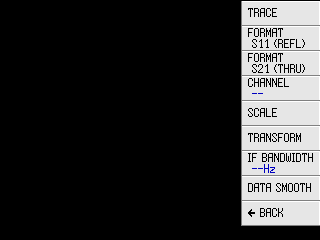

| Item | Type | Description |
|---|---|---|
| TRACE | select | [describe] |
| FORMAT S11 (REFL) | submenu → `menu_formatS11` | [describe] |
| FORMAT S21 (THRU) | submenu → `menu_formatS21` | [describe] |
| CHANNEL ‹--› | value | [describe] |
| SCALE | submenu → `menu_scale` | [describe] |
| TRANSFORM | submenu → `menu_transform` | [describe] |
| IF BANDWIDTH ‹0Hz› | value | [describe] |
| DATA SMOOTH | submenu → `menu_smooth_count` | [describe] |
| ‹ BACK | action |  |

## DISPLAY › TRACE  (`menu_trace`)

 

| Item | Type | Description |
|---|---|---|
| TRACE ‹0› | value | [describe] |
| TRACE ‹1› | value | [describe] |
| TRACE ‹2› | value | [describe] |
| TRACE ‹3› | value | [describe] |
| ‹-- TRACE› | value | [describe] |
| ‹ BACK | action |  |

## DISPLAY › FORMAT  (`menu_formatS11`)

 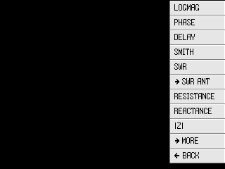

| Item | Type | Description |
|---|---|---|
| LOGMAG | select | [describe] |
| PHASE | select | [describe] |
| DELAY | select | [describe] |
| SMITH | select | [describe] |
| SWR | select | [describe] |
| SWR ANT | select | SWR at the antenna end of the feedline, corrected for the one-way cable loss entered under CABLE LOSS (or computed from CABLE TYPE and CABLE LENGTH). Blank until a loss is set. |
| CABLE LOSS ‹1.20dB› | value | One-way matched loss of the feedline in dB at the band in use; feeds SWR ANT. Entering a value here selects CABLE TYPE = MANUAL. |
| CABLE TYPE ‹MANUAL› | value | H4 only. Coax preset (LMR-400, RG-213, RG-8X, RG-58, RG-174/316) used with CABLE LENGTH to compute the loss for SWR ANT. MANUAL uses the CABLE LOSS value. |
| CABLE LENGTH | select | H4 only. [describe] |
| RESISTANCE | select | [describe] |
| REACTANCE | select | [describe] |
| |Z| | select | [describe] |
| › MORE | submenu → `menu_format2` | [describe] |
| ‹ BACK | action |  |

## DISPLAY › FORMAT › marker_s11smith  (`menu_marker_s11smith`) (variant)

 

| Item | Type | Description |
|---|---|---|
| ‹LIN› | value | [describe] |
| ‹LOG› | value | [describe] |
| ‹Re + Im› | value | [describe] |
| ‹R + jX› | value | [describe] |
| ‹R + L/C› | value | [describe] |
| ‹G + jB› | value | [describe] |
| ‹G + L/C› | value | [describe] |
| ‹R+jX SHUNT› | value | [describe] |
| ‹R+L/C SH..› | value | [describe] |
| ‹ BACK | action |  |

## DISPLAY › FORMAT › marker_s21smith  (`menu_marker_s21smith`) (variant)

 

| Item | Type | Description |
|---|---|---|
| ‹LIN› | value | [describe] |
| ‹LOG› | value | [describe] |
| ‹Re + Im› | value | [describe] |
| ‹R+jX SHUNT› | value | [describe] |
| ‹R+L/C SH..› | value | [describe] |
| ‹R+jX SERIES› | value | [describe] |
| ‹R+L/C SER..› | value | [describe] |
| ‹ BACK | action |  |

## DISPLAY › FORMAT › MORE  (`menu_format2`)

 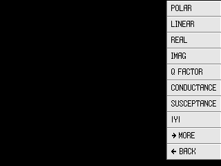

| Item | Type | Description |
|---|---|---|
| POLAR | select | [describe] |
| LINEAR | select | [describe] |
| REAL | select | [describe] |
| IMAG | select | [describe] |
| Q FACTOR | select | [describe] |
| CONDUCTANCE | select | [describe] |
| SUSCEPTANCE | select | [describe] |
| |Y| | select | [describe] |
| › MORE | submenu → `menu_format3` | [describe] |
| ‹ BACK | action |  |

## DISPLAY › FORMAT › MORE › MORE  (`menu_format3`)

 

| Item | Type | Description |
|---|---|---|
| Z PHASE | select | [describe] |
| SERIES C | select | [describe] |
| SERIES L | select | [describe] |
| PARALLEL R | select | [describe] |
| PARALLEL X | select | [describe] |
| PARALLEL C | select | [describe] |
| PARALLEL L | select | [describe] |
| ‹ BACK | action |  |

## DISPLAY › FORMAT  (`menu_formatS21`)

 

| Item | Type | Description |
|---|---|---|
| LOGMAG | select | [describe] |
| PHASE | select | [describe] |
| DELAY | select | [describe] |
| SMITH | select | [describe] |
| POLAR | select | [describe] |
| LINEAR | select | [describe] |
| REAL | select | [describe] |
| IMAG | select | [describe] |
| › MORE | submenu → `menu_format4` | [describe] |
| ‹ BACK | action |  |

## DISPLAY › FORMAT › MORE  (`menu_format4`)

 

| Item | Type | Description |
|---|---|---|
| SERIES R | select | [describe] |
| SERIES X | select | [describe] |
| SERIES |Z| | select | [describe] |
| SHUNT R | select | [describe] |
| SHUNT X | select | [describe] |
| SHUNT |Z| | select | [describe] |
| Q FACTOR | select | [describe] |
| ‹ BACK | action |  |

## DISPLAY › SCALE  (`menu_scale`)

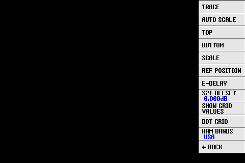 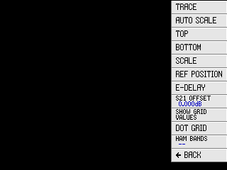

| Item | Type | Description |
|---|---|---|
| TRACE | select | [describe] |
| AUTO SCALE | action | [describe] |
| TOP | select | [describe] |
| BOTTOM | select | [describe] |
| SCALE | select | [describe] |
| REF POSITION | select | [describe] |
| E-DELAY | select | [describe] |
| S21 OFFSET ‹0.000dB› | value | [describe] |
| SHOW GRID VALUES | select | [describe] |
| DOT GRID | select | [describe] |
| HAM BANDS ‹--› | value | [describe] |
| ‹ BACK | action |  |

## DISPLAY › SCALE › HAM BANDS  (`menu_ham_bands`)

 

| Item | Type | Description |
|---|---|---|
| ‹OFF› | value | [describe] |
| ‹IARU R1› | value | [describe] |
| ‹IARU R2› | value | [describe] |
| ‹IARU R3› | value | [describe] |
| ‹USA› | value | [describe] |
| ‹CANADA› | value | [describe] |
| ‹UK› | value | [describe] |
| ‹GERMANY› | value | [describe] |
| ‹JAPAN› | value | [describe] |
| ‹AUSTRALIA› | value | [describe] |
| ‹ BACK | action |  |

## DISPLAY › TRANSFORM  (`menu_transform`)

 

| Item | Type | Description |
|---|---|---|
| TRANSFORM ‹--› | value | [describe] |
| LOW PASS IMPULSE | select | [describe] |
| LOW PASS STEP | select | [describe] |
| BANDPASS | select | [describe] |
| WINDOW ‹--› | value | [describe] |
| VELOCITY F. ‹70%› | value | [describe] |
| ‹ BACK | action |  |

## DISPLAY › IF BANDWIDTH  (`menu_bandwidth`)

 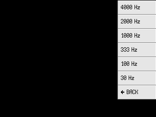

| Item | Type | Description |
|---|---|---|
| ‹4000 Hz› | value | [describe] |
| ‹2000 Hz› | value | [describe] |
| ‹1000 Hz› | value | [describe] |
| ‹333 Hz› | value | [describe] |
| ‹100 Hz› | value | [describe] |
| ‹30 Hz› | value | [describe] |
| ‹ BACK | action |  |

## DISPLAY › DATA SMOOTH  (`menu_smooth_count`)

 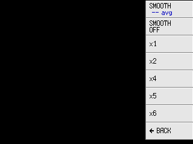

| Item | Type | Description |
|---|---|---|
| SMOOTH ‹-- avg› | value | [describe] |
| SMOOTH OFF | select | [describe] |
| x ‹1› | value | [describe] |
| x ‹2› | value | [describe] |
| x ‹4› | value | [describe] |
| x ‹5› | value | [describe] |
| x ‹6› | value | [describe] |
| ‹ BACK | action |  |

## MARKER  (`menu_marker`)

 

| Item | Type | Description |
|---|---|---|
| SELECT MARKER | submenu → `menu_marker_sel` | [describe] |
| SEARCH ‹--› | value | [describe] |
| SEARCH ‹LEFT | action | [describe] |
| SEARCH ›RIGHT | action | [describe] |
| OPERATIONS | submenu → `menu_marker_ops` | [describe] |
| TRACKING | select | [describe] |
| ‹ BACK | action |  |

## MARKER › SELECT  (`menu_marker_sel`)

 

| Item | Type | Description |
|---|---|---|
| MARKER ‹1› | value | [describe] |
| MARKER ‹2› | value | [describe] |
| MARKER ‹3› | value | [describe] |
| MARKER ‹4› | value | [describe] |
| MARKER ‹5› | value | [describe] |
| MARKER ‹6› | value | [describe] |
| MARKER ‹7› | value | [describe] |
| MARKER ‹8› | value | [describe] |
| ALL OFF | action | [describe] |
| DELTA | select | [describe] |
| ‹ BACK | action |  |

## MARKER › OPERATIONS  (`menu_marker_ops`)

 

| Item | Type | Description |
|---|---|---|
| › START | action | [describe] |
| › STOP | action | [describe] |
| › CENTER | action | [describe] |
| › SPAN | action | [describe] |
| › E-DELAY | action | [describe] |
| ‹ BACK | action |  |

## STIMULUS  (`menu_stimulus`)

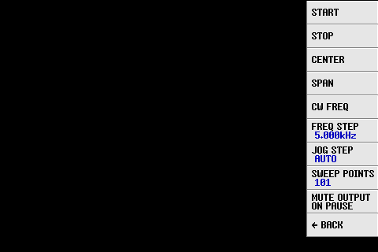 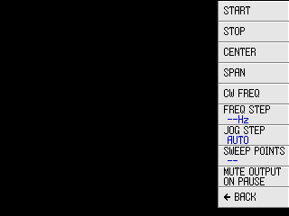

| Item | Type | Description |
|---|---|---|
| START | select | [describe] |
| STOP | select | [describe] |
| CENTER | select | [describe] |
| SPAN | select | [describe] |
| CW FREQ | select | [describe] |
| FREQ STEP ‹--Hz› | value | [describe] |
| JOG STEP AUTO | select | [describe] |
| SWEEP POINTS ‹0› | value | [describe] |
| MUTE OUTPUT ON PAUSE | select | [describe] |
| ‹ BACK | action |  |

## STIMULUS › SWEEP POINTS  (`menu_sweep_points`)

 

| Item | Type | Description |
|---|---|---|
| SET POINTS ‹--› | value | [describe] |
| ‹51 point› | value | [describe] |
| ‹101 point› | value | [describe] |
| ‹201 point› | value | [describe] |
| ‹301 point› | value | [describe] |
| ‹401 point› | value | [describe] |
| ‹ BACK | action |  |

## CALIBRATE  (`menu_cal`)

 

| Item | Type | Description |
|---|---|---|
| CALIBRATE | submenu → `menu_calop` | [describe] |
| POWER  AUTO | select | [describe] |
| SAVE | submenu → `menu_save` | [describe] |
| RANGE | select | [describe] |
| RESET | action | [describe] |
| APPLY | select | [describe] |
| ENHANCED RESPONSE | select | [describe] |
| ‹ BACK | action |  |

## CALIBRATE › CALIBRATE  (`menu_calop`)

 

| Item | Type | Description |
|---|---|---|
| OPEN | select | [describe] |
| SHORT | select | [describe] |
| LOAD | select | [describe] |
| ISOLN | select | [describe] |
| THRU | select | [describe] |
| DONE | action | [describe] |
| DONE IN RAM | action | [describe] |
| ‹ BACK | action |  |

## CALIBRATE › CALIBRATE › DONE  (`menu_save`)

 

| Item | Type | Description |
|---|---|---|
| SAVE TO SD CARD | action | [describe] |
| Empty ‹0› | value | [describe] |
| Empty ‹1› | value | [describe] |
| Empty ‹2› | value | [describe] |
| Empty ‹3› | value | [describe] |
| Empty ‹4› | value | [describe] |
| Empty ‹5› | value | [describe] |
| Empty ‹6› | value | [describe] |
| ‹ BACK | action |  |

## CALIBRATE › POWER  AUTO  (`menu_power`)

 

| Item | Type | Description |
|---|---|---|
| AUTO | select | [describe] |
| ‹2 mA› | value | [describe] |
| ‹4 mA› | value | [describe] |
| ‹6 mA› | value | [describe] |
| ‹8 mA› | value | [describe] |
| ‹ BACK | action |  |

## RECALL  (`menu_recall`)

 

| Item | Type | Description |
|---|---|---|
| LOAD FROM SD CARD | action | [describe] |
| Empty ‹0› | value | [describe] |
| Empty ‹1› | value | [describe] |
| Empty ‹2› | value | [describe] |
| Empty ‹3› | value | [describe] |
| Empty ‹4› | value | [describe] |
| Empty ‹5› | value | [describe] |
| Empty ‹6› | value | [describe] |
| ‹ BACK | action |  |

## MEASURE › L/C MATCH  (`menu_measure`) (variant)

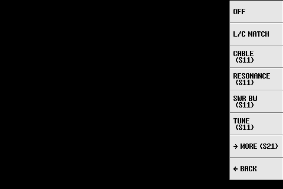 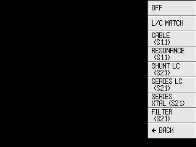

| Item | Type | Description |
|---|---|---|
| OFF | select | [describe] |
| L/C MATCH | select | [describe] |
| CABLE (S11) | select | [describe] |
| RESONANCE (S11) | select | [describe] |
| SWR BW (S11) | select | H4 only. [describe] |
| SHUNT LC (S21) | select | [describe] |
| SERIES LC (S21) | select | [describe] |
| SERIES XTAL (S21) | select | [describe] |
| FILTER (S21) | select | [describe] |
| ‹ BACK | action |  |

## MEASURE › L/C MATCH › L/C MATCH  (`menu_measure_lc`) (variant)

 

| Item | Type | Description |
|---|---|---|
| OFF | select | [describe] |
| L/C MATCH | select | [describe] |
| ‹ BACK | action |  |

## MEASURE › L/C MATCH › SHUNT LC  (`menu_measure_s21`) (variant)

 

| Item | Type | Description |
|---|---|---|
| OFF | select | [describe] |
| SHUNT LC (S21) | select | [describe] |
| SERIES LC (S21) | select | [describe] |
| SERIES XTAL (S21) | select | [describe] |
| Rl = ‹--Ω› | value | [describe] |
| ‹ BACK | action |  |

## MEASURE › L/C MATCH › FILTER  (`menu_measure_filter`) (variant)

 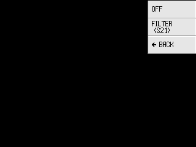

| Item | Type | Description |
|---|---|---|
| OFF | select | [describe] |
| FILTER (S21) | select | [describe] |
| ‹ BACK | action |  |

## MEASURE › L/C MATCH › CABLE  (`menu_measure_cable`) (variant)

 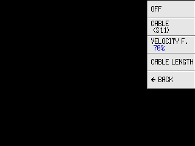

| Item | Type | Description |
|---|---|---|
| OFF | select | [describe] |
| CABLE (S11) | select | [describe] |
| VELOCITY F. ‹70%› | value | [describe] |
| CABLE LENGTH | select | [describe] |
| ‹ BACK | action |  |

## MEASURE › L/C MATCH › RESONANCE  (`menu_measure_resonance`) (variant)

 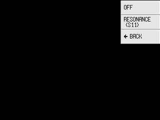

| Item | Type | Description |
|---|---|---|
| OFF | select | [describe] |
| RESONANCE (S11) | select | [describe] |
| ‹ BACK | action |  |

## MEASURE › L/C MATCH › SWR BW  (`menu_measure_swr_bw`) (variant)

*H4 only.*

| Item | Type | Description |
|---|---|---|
| OFF | select | [describe] |
| SWR BW (S11) | select | Bandwidth and Q of the SWR dip nearest the active marker: f0, minimum SWR, 2:1 and 3:1 edge frequencies, Q (Yaghjian & Best, using the measured R at the dip). |
| ‹ BACK | action |  |

## SD CARD  (`menu_sdcard`)

 

| Item | Type | Description |
|---|---|---|
| LOAD | submenu → `menu_sdcard_browse` | [describe] |
| SAVE S1P | action | [describe] |
| SAVE S2P | action | [describe] |
| SCREENSHOT | action | [describe] |
| SAVE CALIBRATION | action | [describe] |
| AUTO NAME | select | [describe] |
| IMAGE FORMAT ‹--› | value | [describe] |
| ‹ BACK | action |  |

## SD CARD › LOAD  (`menu_sdcard_browse`)

 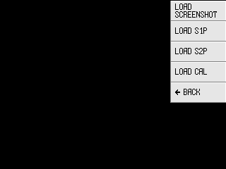

| Item | Type | Description |
|---|---|---|
| LOAD SCREENSHOT | action | [describe] |
| LOAD S1P | action | [describe] |
| LOAD S2P | action | [describe] |
| LOAD CAL | action | [describe] |
| ‹ BACK | action |  |

## CONFIG  (`menu_config`)

 

| Item | Type | Description |
|---|---|---|
| TOUCH CAL | action | [describe] |
| TOUCH TEST | action | [describe] |
| EXPERT SETTINGS | submenu → `menu_device` | [describe] |
| SAVE CONFIG | action | [describe] |
| CONNECTION | submenu → `menu_connection` | [describe] |
| VERSION | action | [describe] |
| BRIGHTNESS ‹--%› | value | H4 only. [describe] |
| DATE/TIME | submenu → `menu_rtc` | [describe] |
| ‹ BACK | action |  |

## CONFIG › EXPERT  (`menu_device`)

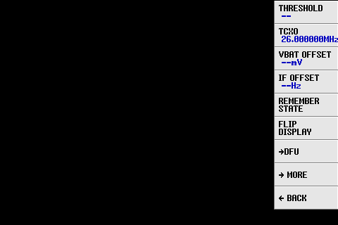 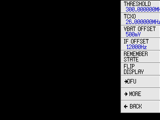

| Item | Type | Description |
|---|---|---|
| THRESHOLD ‹--› | value | [describe] |
| TCXO ‹26.000000MHz› | value | [describe] |
| VBAT OFFSET ‹--mV› | value | [describe] |
| IF OFFSET ‹0Hz› | value | [describe] |
| REMEMBER STATE | select | [describe] |
| FLIP DISPLAY | select | [describe] |
| › DFU | submenu → `menu_dfu` | [describe] |
| › MORE | submenu → `menu_device1` | [describe] |
| ‹ BACK | action |  |

## CONFIG › EXPERT › IF OFFSET  (`menu_offset`)

 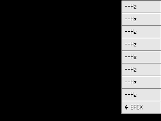

| Item | Type | Description |
|---|---|---|
| ‹4000Hz› | value | [describe] |
| ‹8000Hz› | value | [describe] |
| ‹12000Hz› | value | [describe] |
| ‹16000Hz› | value | [describe] |
| ‹20000Hz› | value | [describe] |
| ‹24000Hz› | value | [describe] |
| ‹28000Hz› | value | [describe] |
| ‹32000Hz› | value | [describe] |
| ‹ BACK | action |  |

## CONFIG › EXPERT › DFU  (`menu_dfu`)

 

| Item | Type | Description |
|---|---|---|
| RESET AND ENTER DFU | action | [describe] |
| ‹ BACK | action |  |

## CONFIG › EXPERT › MORE  (`menu_device1`)

 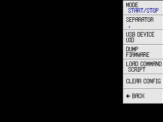

| Item | Type | Description |
|---|---|---|
| MODE ‹--› | value | [describe] |
| SEPARATOR ‹--› | value | [describe] |
| USB DEVICE UID | select | [describe] |
| DUMP FIRMWARE | action | [describe] |
| LOAD COMMAND SCRIPT | action | [describe] |
| CLEAR CONFIG | submenu → `menu_clear` | [describe] |
| ‹ BACK | action |  |

## CONFIG › EXPERT › MORE › CLEAR CONFIG  (`menu_clear`)

 

| Item | Type | Description |
|---|---|---|
| CLEAR ALL AND RESET | action | [describe] |
| ‹ BACK | action |  |

## CONFIG › CONNECTION  (`menu_connection`)

 

| Item | Type | Description |
|---|---|---|
| CONNECTION ‹--› | value | [describe] |
| SERIAL SPEED ‹0› | value | [describe] |
| ‹ BACK | action |  |

## CONFIG › CONNECTION › SERIAL SPEED  (`menu_serial_speed`)

 

| Item | Type | Description |
|---|---|---|
| ‹19200› | value | [describe] |
| ‹38400› | value | [describe] |
| ‹57600› | value | [describe] |
| ‹115200› | value | [describe] |
| ‹230400› | value | [describe] |
| ‹460800› | value | [describe] |
| ‹921600› | value | [describe] |
| ‹1843200› | value | [describe] |
| ‹2000000› | value | [describe] |
| ‹3000000› | value | [describe] |
| ‹ BACK | action |  |

## CONFIG › DATE/TIME  (`menu_rtc`)

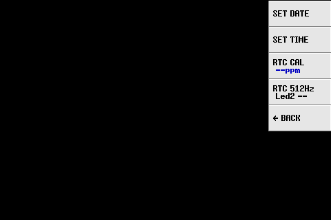 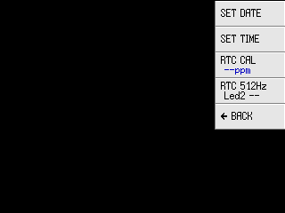

| Item | Type | Description |
|---|---|---|
| SET DATE | select | [describe] |
| SET TIME | select | [describe] |
| RTC CAL ‹--ppm› | value | [describe] |
| RTC 512Hz Led2 ‹--› | value | [describe] |
| ‹ BACK | action |  |
